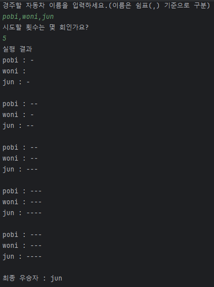

# kotlin-racingcar-precourse
# 구현할 기능
- [X] 경주를 진행하는 RacingGame 구현
    - [X] 자동차의 이름과 시도 횟수를 입력받아 경주를 시작하는 init() 
    - [X] 입력받은 시도 횟수를 반복하며 자동차의 이동을 담당하는 racing()
    - [X] 시도 횟수가 다 진행된 후 최종 집계를 하는 result()
- [X] Car 구현
  - [X] 정지와 이동을 결정하는 carMove()
  - [X] 현재 위치를 return하는 getPosition()
- [X] 에외처리

# 구현 과정
## 1. init()
+ init()의 기능은 사용자로부터 자동차의 이름과 시도 횟수를 입력받고 경주를 시작하는 것

1주차 과제에서 다른 사람들의 코드를 읽어보았는데 많은 사람들이 기능별로 클래스를 나누어 구현을 하였고 가독성이 더 뛰어나다고 느꼈다.

그래서 이번 과제는 클래스를 나누어 구현해보려고 한다.

```
class RacingGame {
    private lateinit var carList: List<Car>

    fun init() {
        println("경주할 자동차 이름을 입력하세요.(이름은 쉼표(,) 기준으로 구분)")
        carList = Console.readLine().split(",").map { Car(it) }
        println("시도할 횟수는 몇 회인가요?")
        val moveCount = Console.readLine().toInt()
        racing(moveCount)
    }

}
```
1주차 피드백에서 컬렉션 사용을 권장하였기에 자동차의 목록을 관리하는 carList를 List로 구현하였다.

## 2. racing()
+ racing의 기능은 각 자동차의 이동을 시도 횟수만큼 진행하는 것

그렇기에 carList의 element들을 각각 이동함수 carMove()를 실행시켜주도록 구현하였다.

```
private fun racing(moveCount: Int) {
        repeat(moveCount) {
            carList.forEach { it.carMove() }
        }
        result()
}
```

## 3.result()
+ result()의 기능은 가장 멀리 이동한 우승자들을 출력하는 것

```
private fun result() {
        println("최종 우승자 : " + carList.filter {
            it.getPosition() == carList.maxByOrNull { car ->
                car.getPosition()
            }!!.getPosition()
        }.joinToString(", ") { it.name } )
}
```

maxByOrNull을 통해 max값을 찾고 filter를 사용하여 carList에서 max값을 갖는 모든 자동차를 찾는다.

이후 코틀린에서 지원하는 API를 활용하라는 피드백을 참고하여 joinToString()을 통해 결과를 출력한다.

## 4.Car
+ Car는 랜덤한 값을 이용하여 이동 여부를 결정한다.

```Randoms.pickNumberInRange(0, 9)```
을 통해 랜덤 정수를 반환하여 이것이 4 이상이면 이동하기 위해 
```
fun carMove() {
        if (Randoms.pickNumberInRange(0, 9) > 3) {
            position++
        }
        println("$name : " + "-".repeat(position))
}
```
위와 같이 구현

또한 getPosition은 단순히 postion값을 리턴하는 메소드로 positon값을 return해준다.

## 5.예외처리
+ 쉼표 기준으로 이름은 5자 이하
+ 시도 횟수가 정수가 아닐 경우

사용자가 잘못된 값을 입력할 경우 IllegalArgumentException을 발생시킨 후 애플리케이션은 종료되어야 한다.

라는 조건이 있으므로 위의 두 잘못 입력된 경우에 IllegalArgumentException을 발생시키도록 수정해준다.

```
fun init() {
        println("경주할 자동차 이름을 입력하세요.(이름은 쉼표(,) 기준으로 구분)")
        carList =
            Console.readLine().split(",").map { if (it.length <= 5) Car(it) else throw IllegalArgumentException() }
        println("시도할 횟수는 몇 회인가요?")
        val moveCount = Console.readLine().toIntOrNull() ?: throw IllegalArgumentException()
        racing(moveCount)
}
```




테스트도 잘 돌아가고 결과도 제대로 출력된다.


예외처리도 정상적으로 작동된다.